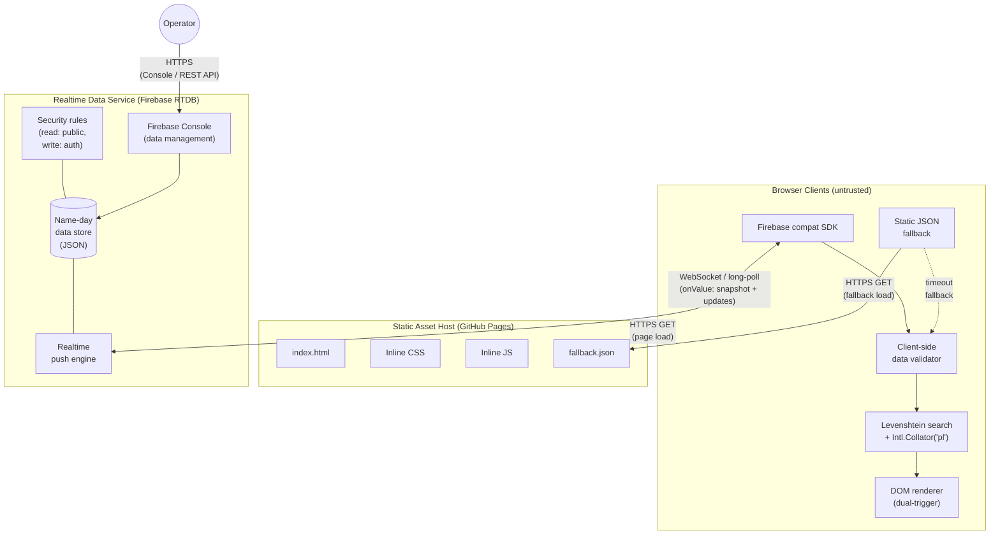

# High-level Architecture — Polish Name Days (Realtime)

## Diagram

## Browser Client

The browser client is the only user-facing deployment unit. It loads static assets (HTML, CSS, JS) from GitHub Pages via a standard HTTPS GET on page load, then establishes a persistent realtime subscription to Firebase RTDB via the Firebase compat SDK. The SDK uses WebSocket as its primary transport, automatically falling back to HTTPS long-polling on networks that block WebSocket ([ADR-01-01](../../GENESIS_SUPPORT/adr/01-data/adr-01-01-realtime-data-service.md)). On the initial `onValue` callback, the client receives the full name-day dataset as a JSON snapshot, transforms it to an in-memory `{ name: [dates] }` map, extracts the name key index, and attaches the `keyup` search listener ([ADR-02-01](../../GENESIS_SUPPORT/adr/02-frontend/adr-02-01-client-architecture.md)). On every subsequent `onValue` callback (triggered by data changes in Firebase RTDB), the client rebuilds its in-memory map and key index, and re-runs the search if the input field is non-empty — making newly added names immediately visible ([ADR-02-02](../../GENESIS_SUPPORT/adr/02-frontend/adr-02-02-search-preservation.md)). A client-side validator rejects malformed entries (empty names, invalid DD.MM dates) before they enter the search index. If the Firebase connection fails on initial load (5-second timeout) or the SDK itself fails to load, the client falls back to a static JSON snapshot served from GitHub Pages, providing degraded but functional search on stale data ([ADR-02-01](../../GENESIS_SUPPORT/adr/02-frontend/adr-02-01-client-architecture.md) §4).

## Static Asset Host (GitHub Pages)

GitHub Pages serves the application's static files: `index.html` (with inline CSS and JS), the Firebase compat SDK `<script>` tags (referencing Google's CDN), and a `fallback.json` file containing a periodic snapshot of the name-day dataset ([ADR-03-01](../../GENESIS_SUPPORT/adr/03-infrastructure/adr-03-01-hosting-strategy.md)). This deployment unit is unchanged from the current system — code is deployed by pushing to the repository, and GitHub Pages auto-deploys. It has no server-side logic, no state, and no connection to Firebase RTDB. Its independence from the Realtime Data Service means the site continues to load even during Firebase outages, with the fallback JSON providing baseline data for search.

## Realtime Data Service (Firebase RTDB)

Firebase Realtime Database is the single new infrastructure component. It serves three roles absorbed from the topology: persistent data storage (a flat JSON tree under `/nameDays` keyed by Polish name, with indexed date sub-objects — [ADR-01-02](../../GENESIS_SUPPORT/adr/01-data/adr-01-02-data-schema.md)), realtime push delivery (the push engine fires `onValue` callbacks to all subscribed clients within seconds of a data change), and data management interface (the operator adds new name-day entries via the Firebase Console web UI or the HTTPS REST API — no custom admin backend needed) ([ADR-01-01](../../GENESIS_SUPPORT/adr/01-data/adr-01-01-realtime-data-service.md)). Security rules enforce public read access and authenticated-only write access, with schema validation ensuring non-empty names and valid DD.MM date formats ([ADR-01-02](../../GENESIS_SUPPORT/adr/01-data/adr-01-02-data-schema.md)). The service runs on Firebase's free Spark plan (1 GB storage, 10 GB/month download, 100 simultaneous connections), which is orders of magnitude above the ~200 KB dataset and expected low-traffic usage.

## Search and Polish Locale Handling

The fuzzy search subsystem lives entirely within the browser client. It uses the existing custom Levenshtein distance algorithm with `Intl.Collator("pl", { sensitivity: "base" })` for Polish diacritics-insensitive comparison — unchanged from the current implementation ([ADR-02-02](../../GENESIS_SUPPORT/adr/02-frontend/adr-02-02-search-preservation.md)). The only modification is that the name key index (`keys` array) is now mutable, re-extracted from the in-memory data map on every `onValue` callback. Performance is <50ms per keystroke at the current dataset size (~4700 names) and projected <120ms at 2x scale, well within the 200ms PRD-003 threshold. No server-side search, no external search library, and no build tooling are involved.

## Resilience

The architecture addresses all eight failure scenarios from the constraints document. Firebase SDK outages are mitigated by the static JSON fallback loaded from GitHub Pages after a 5-second timeout ([ADR-02-01](../../GENESIS_SUPPORT/adr/02-frontend/adr-02-01-client-architecture.md) §4). Connection drops mid-session are handled by the Firebase SDK's built-in automatic reconnection and state re-synchronisation ([ADR-01-01](../../GENESIS_SUPPORT/adr/01-data/adr-01-01-realtime-data-service.md)). Malformed data is filtered by both Firebase Security Rules (server-side validation) and client-side regex validation before entering the search index ([ADR-01-02](../../GENESIS_SUPPORT/adr/01-data/adr-01-02-data-schema.md), [ADR-02-01](../../GENESIS_SUPPORT/adr/02-frontend/adr-02-01-client-architecture.md) §6). Provider lock-in is mitigated by the data's trivial portability (~200 KB JSON exportable via REST) and the thin client integration surface (single listener callback).

## Traffic and communication summary

| From | To | Protocol | Purpose | ADR |
|------|----|----------|---------|-----|
| Browser Client | GitHub Pages | HTTPS GET | Load static assets (HTML, CSS, JS, fallback JSON) on page load | [ADR-03-01](../../GENESIS_SUPPORT/adr/03-infrastructure/adr-03-01-hosting-strategy.md) |
| Browser Client | Firebase RTDB | WebSocket (primary) / HTTPS long-poll (fallback) | Realtime subscription: initial dataset snapshot + incremental updates on data change | [ADR-01-01](../../GENESIS_SUPPORT/adr/01-data/adr-01-01-realtime-data-service.md) |
| Firebase RTDB | Browser Client | WebSocket (primary) / HTTPS long-poll (fallback) | Push name-day data changes to subscribed clients | [ADR-01-01](../../GENESIS_SUPPORT/adr/01-data/adr-01-01-realtime-data-service.md) |
| Operator | Firebase RTDB | HTTPS (Console UI / REST API) | Add new name-day entries, manage data | [ADR-01-01](../../GENESIS_SUPPORT/adr/01-data/adr-01-01-realtime-data-service.md) |
| Browser Client | Google CDN | HTTPS GET | Load Firebase compat SDK (~40 KB gzipped) | [ADR-02-01](../../GENESIS_SUPPORT/adr/02-frontend/adr-02-01-client-architecture.md) |

## Encryption summary

| Layer | Mechanism | ADR |
|-------|-----------|-----|
| Browser ↔ GitHub Pages | TLS (HTTPS) — provided by GitHub Pages | [ADR-03-01](../../GENESIS_SUPPORT/adr/03-infrastructure/adr-03-01-hosting-strategy.md) |
| Browser ↔ Firebase RTDB | TLS (WSS / HTTPS) — provided by Firebase SDK | [ADR-01-01](../../GENESIS_SUPPORT/adr/01-data/adr-01-01-realtime-data-service.md) |
| Operator ↔ Firebase Console | TLS (HTTPS) — provided by Firebase Console | [ADR-01-01](../../GENESIS_SUPPORT/adr/01-data/adr-01-01-realtime-data-service.md) |
| Data at rest in Firebase RTDB | Google-managed encryption at rest (AES-256) — default for all Firebase services | [ADR-01-01](../../GENESIS_SUPPORT/adr/01-data/adr-01-01-realtime-data-service.md) |
