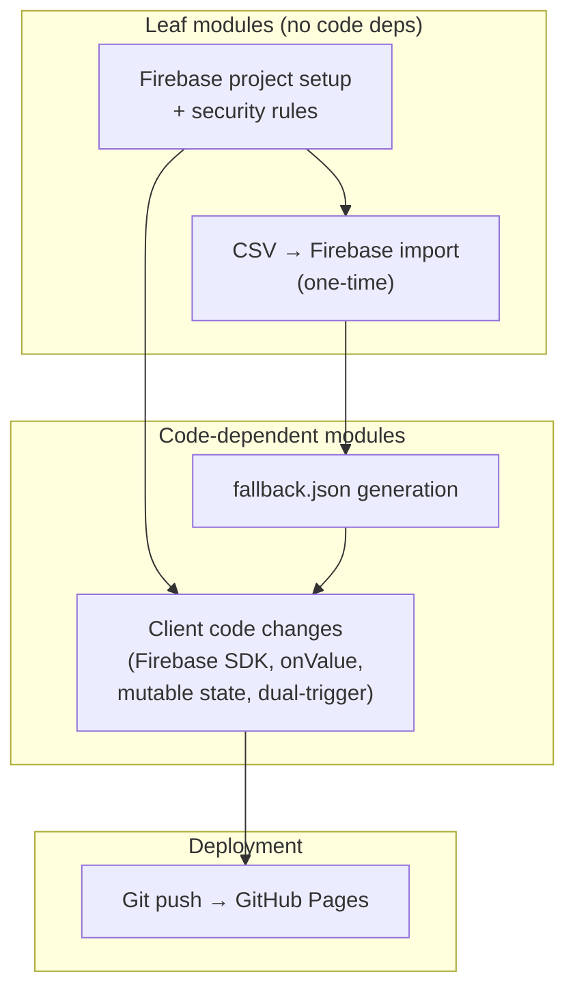

# Transformation Plan — Polish Name Days (Realtime)

The transformation from static CSV-based name-day lookup to realtime Firebase-backed lookup is **atomic** — a single cutover with no phased coexistence of distinct application versions. The plan documents sequencing, contract verification, rollback, and test strategy.

## Module dependency graph

The codebase is a single file (`index.html`) with logical units:

- **Firebase project setup**: Create Firebase project, enable Realtime Database, configure security rules. No code dependencies.
- **Data migration**: Import `name-days.csv` into Firebase RTDB under `/nameDays` using the schema in [ADR-01-02](../../GENESIS_SUPPORT/adr/01-data/adr-01-02-data-schema.md). Depends on Firebase project existing.
- **fallback.json generation**: Produce static JSON snapshot for resilience ([ADR-02-01](../../GENESIS_SUPPORT/adr/02-frontend/adr-02-01-client-architecture.md) §4). Can derive from Firebase export or CSV→JSON conversion. Depends on data being available in target format.
- **Client code changes**: Modify `index.html` — add Firebase SDK scripts, replace `load()` with `onValue`, mutable state, dual-trigger rendering, fallback logic. Depends on Firebase project (for config URL) and `fallback.json` (for fallback path).
- **Deployment**: Git push. GitHub Pages auto-deploys. Depends on all prior steps.

## Migration ordering

| Step | Action | Prerequisite | Output |
|------|--------|--------------|--------|
| 1 | Create Firebase project, enable RTDB, deploy security rules | None | Firebase project URL, rules active |
| 2 | Convert `name-days.csv` to JSON and import into `/nameDays` | Step 1 | Firebase RTDB populated |
| 3 | Generate `fallback.json` (export from Firebase or convert CSV) | Step 2 | `fallback.json` in repo |
| 4 | Add Firebase SDK `<script>` tags, Firebase config block | Step 1 | — |
| 5 | Replace `load()` + promise chain with `onValue` listener | Step 4 | — |
| 6 | Refactor closure-based state to module-level mutable `data`, `keys` | Step 5 | — |
| 7 | Add data-change trigger to `reconsolidate` (dual-trigger) | Step 6 | — |
| 8 | Add 5s timeout + static fallback load on Firebase failure | Step 3 | — |
| 9 | Add client-side validation (name non-empty, date regex) | Step 5 | — |
| 10 | Deploy to GitHub Pages (git push) | Steps 3–9 complete | Live site |

Steps 4–9 are implementation details within a single work package; the ordering above reflects internal dependencies.

## Coexistence design

**Not applicable.** The transformation is a single cutover. There is no period where the old CSV-based client and the new Firebase-based client run in parallel for different user segments. The old system remains live until the new deployment; at cutover, all users receive the new client on their next page load.

- **Database**: No shared database. CSV is superseded by Firebase RTDB. The CSV remains in the repository for rollback and historical reference.
- **Request routing**: N/A — single static site, no routing.
- **Session/auth**: N/A — stateless, anonymous.
- **Data consistency**: One-time migration. After import, Firebase RTDB is authoritative. The `fallback.json` is a point-in-time snapshot; it may drift from live data but is used only when Firebase is unreachable.

## Interop boundary design

| Boundary | Type | Contract | Authoritative side |
|----------|------|----------|-------------------|
| Browser ↔ Firebase RTDB | Realtime subscription | Firebase SDK `onValue` delivers JSON snapshot; client transforms to `{ name: [dates] }` per [ADR-01-02](../../GENESIS_SUPPORT/adr/01-data/adr-01-02-data-schema.md) | Firebase RTDB |
| Browser ↔ Static fallback | HTTP GET | JSON file with same semantic structure (`name → [dates]`) | GitHub Pages |
| Operator ↔ Firebase | Console / REST API | Write via Firebase Console or REST; schema enforced by security rules | Operator |

## Contract preservation plan

| Contract | Must preserve | Verification method | When verified |
|----------|---------------|---------------------|---------------|
| Search UX: name → top 3 matches with dates | Yes | Manual: type "Zofia", verify top 3 with dates; type "An", verify matches | After client code deployment |
| Polish diacritics: "Zofia" ≈ "Żofia" | Yes | Manual: search both variants, verify same/diacritics-insensitive results | After client code deployment |
| Data schema: name → list of DD.MM dates | Yes (semantic) | Validate Firebase structure matches `{ name: { 0: "DD.MM", ... } }`; client transforms to `{ name: ["DD.MM", ...] }` | After migration script |
| CSV format | No | N/A — replaced by JSON | — |
| GitHub Pages URL | No (data source) | N/A — data moves to Firebase | — |

## Rollback plan

| Step | Rollback mechanism | Data implications | One-way door? |
|------|-------------------|-------------------|---------------|
| Post–git push | `git revert` the commit(s), push. GitHub Pages redeploys previous version. | None. `index.html` reverts to CSV fetch. `name-days.csv` unchanged in repo. | No |
| Post–Firebase import | Revert is still git-based. CSV in repo is intact. If rollback needed, old client uses CSV. Firebase data is orphaned but harmless. | Firebase data remains but is unused after revert. No data loss. | No |
| Post–fallback.json add | Reverting removes `fallback.json`. Old client does not reference it. | None. | No |

**Rollback procedure**: `git revert <commit>` then `git push`. The site returns to CSV-based behaviour within minutes (GitHub Pages deploy lag). No Firebase teardown required for rollback.

## Test migration strategy

| Aspect | Strategy |
|--------|----------|
| **Conversion timing** | Migrate data before deploying client changes. Verify data in Firebase Console (structure, sample queries). |
| **Dual-run period** | None — atomic cutover. |
| **Module completion definition** | Client code changes complete when: (1) Firebase `onValue` fires and populates search, (2) typing triggers search, (3) simulated Firebase update (add name via Console) triggers re-render without keystroke, (4) 5s timeout with Firebase offline loads fallback. |
| **Regression checks** | After deployment: run same manual searches as current production. Verify top-3 behaviour, Polish diacritics, date display format. |
| **Fallback verification** | Block Firebase domain (browser dev tools or hosts file) or disconnect network after fallback load — verify search works on static data. |

## Risk assessment (Pattern Translator)

From [03-pattern-map.md](../../GENESIS_SUPPORT/03-pattern-map.md):

| Pattern | Risk | Mitigation |
|---------|------|------------|
| Closure → mutable state (#3) | High — state mutation must trigger re-render | Dual-trigger design: `onValue` callback updates `data`/`keys` and calls `reconsolidate` if input non-empty |
| One-time fetch → subscription (#4) | High — unified data flow | Single `onValue` listener; initial snapshot + incremental updates from same channel |
| Static key extraction → dynamic (#5) | Medium — re-extract on every `onValue` | `keys = Object.keys(data)` in listener callback |
| Full DOM clear + rebuild with data-change (#6) | Medium — render trigger conflict | Explicit dual-trigger: keyup and onValue both invoke `reconsolidate` |

Conversion sequencing: All pattern conversions occur in a single client-code change. No incremental conversion of individual patterns — the refactor is atomic for the ~200-line file.
