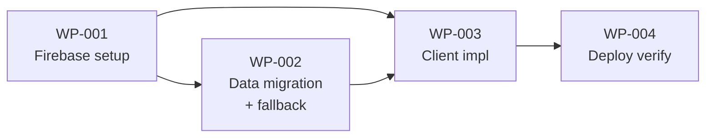

# Work Packages — Polish Name Days (Realtime)

## Work package table

| WP | Title | Description | Implements | Depends on | Inputs | Outputs | Acceptance criteria | Scope |
|----|-------|-------------|------------|------------|--------|---------|---------------------|-------|
| WP-001 | Firebase project setup | Create Firebase project, enable Realtime Database, deploy security rules for public read and authenticated write. | ADR-01-01, ADR-01-02, ADR-03-01 | — | — | Firebase project URL, deployed security rules | Firebase project exists; RTDB enabled; security rules enforce `.read: true` and `.write: "auth != null"` on `/nameDays`; project on Spark (free) plan | S |
| WP-002 | Data migration and fallback | Convert `name-days.csv` to JSON per ADR-01-02 schema, import into Firebase `/nameDays`, generate `fallback.json` for resilience. | ADR-01-02, ADR-02-01, ADR-03-01 | WP-001 | `name-days.csv`, Firebase project | Firebase RTDB populated, `fallback.json` in repo | All ~6602 name-date pairs from CSV appear in Firebase under `/nameDays` with correct schema (`name: { 0: "DD.MM", ... }`); `fallback.json` contains same semantic structure and is placed in repo root | M |
| WP-003 | Client implementation | Modify `index.html`: add Firebase SDK, replace `load()` with `onValue`, mutable state, dual-trigger rendering, 5s timeout fallback, client-side validation. | ADR-01-01, ADR-01-02, ADR-02-01, ADR-02-02, ADR-03-01 | WP-001, WP-002 | Firebase config, `fallback.json` | Modified `index.html` | Firebase `onValue` delivers initial snapshot and subsequent updates; `data` and `keys` re-extracted on each callback; typing and data-change both trigger `reconsolidate`; after 5s timeout with no Firebase response, fallback.json loads and search works; malformed entries (empty name, invalid DD.MM) are skipped; Levenshtein and `Intl.Collator("pl")` unchanged | L |
| WP-004 | Deployment verification | Deploy to GitHub Pages and verify all PRD success criteria. | PRD-001, PRD-002, PRD-003, PRD-004, PRD-005 | WP-003 | Modified `index.html`, `fallback.json` | Live deployed site | Site loads from GitHub Pages; search returns results; adding a name via Firebase Console causes it to appear in active sessions within 60s without reload; Polish diacritics work (e.g. "Zofia" matches "Żofia"); with Firebase blocked, fallback loads and search works; component count ≤3 | S |

## Dependency graph

## Critical path

**WP-001 → WP-002 → WP-003 → WP-004** (longest dependency chain). All work packages lie on the critical path; there is no parallel branch. WP-003 is the largest scope.

## Integration points

| Integration point | Producing WPs | Consuming WP | Contract |
|------------------|---------------|--------------|----------|
| Firebase config | WP-001 | WP-003 | Project URL (`databaseURL`), API key (or equivalent) for Firebase SDK initialisation; config block injected into `index.html` |
| Firebase data schema | WP-002 | WP-003 | `/nameDays` JSON: `{ name: { "0": "DD.MM", "1": "DD.MM", ... }, ... }`; client transforms to `{ name: ["DD.MM", ...] }` |
| Static fallback | WP-002 | WP-003 | `fallback.json` at repo root; JSON structure compatible with client transform (name → array of DD.MM strings); served from same origin as `index.html` |
