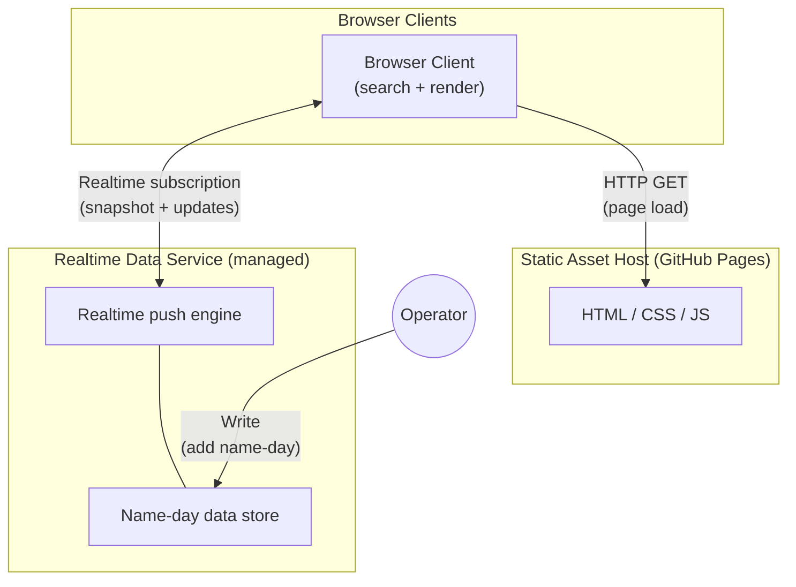

# Topology — Polish Name Days (Realtime)

## Design rationale

The source topology is a single unit: a static site on GitHub Pages. The target must add realtime data delivery while respecting: solo operator profile, max 2–3 new components, free-tier cost, and no dedicated infrastructure expertise.

The shape is driven by three forces:
1. **Realtime push requires a persistent connection endpoint** — GitHub Pages cannot provide this. A new service component is unavoidable.
2. **Data management requires a writable store** — the static CSV has no write path. The writable store and the realtime push should be the same component to avoid adding two.
3. **Static asset hosting is already solved** — GitHub Pages works. Replacing it adds migration cost for no gain. Keep it.

This yields a **two-tier topology**: a static asset host (existing) and a managed realtime data service (new). The browser client bridges both. Data management (adding names) is an operator action against the data service — not a separate component.

## Deployment units

| Unit | Role | Count | Trust level | Offline capability |
|------|------|-------|------------|-------------------|
| **Browser Client** | Loads static assets, subscribes to realtime data, runs fuzzy search, renders results | Many (one per user session) | Untrusted — public, anonymous | Degraded — continues searching last-known dataset if realtime connection drops; no offline-first capability |
| **Static Asset Host** | Serves HTML, CSS, JS files to browser clients | 1 (existing — GitHub Pages) | Trusted — serves application code | N/A — if down, new page loads fail but existing sessions unaffected |
| **Realtime Data Service** | Stores name-day data, pushes changes to subscribed clients, accepts writes from operator | 1 (new — managed service) | Trusted — holds authoritative data; write access restricted to operator | N/A — managed service; availability is provider's responsibility |

**Total infrastructure components (excluding browser):** 2 (Static Asset Host + Realtime Data Service).
**New components:** 1 (Realtime Data Service). Within budget of max 2–3 new.

## Trust boundaries

```
┌─────────────────────────────────────────────────────────┐
│ PUBLIC INTERNET (untrusted)                              │
│                                                         │
│   ┌──────────────┐                                      │
│   │Browser Client│ ← anonymous, no credentials          │
│   └──────┬───────┘                                      │
│          │                                              │
├──────────┼──────────────────────────────────────────────┤
│          │ HTTPS                                        │
│   ┌──────▼──────────────┐   ┌─────────────────────────┐ │
│   │ Static Asset Host   │   │ Realtime Data Service   │ │
│   │ (GitHub Pages)      │   │ (managed)               │ │
│   │ read-only           │   │ read: public            │ │
│   │                     │   │ write: operator-only    │ │
│   └─────────────────────┘   └─────────────────────────┘ │
│ TRUSTED SERVICES                                        │
└─────────────────────────────────────────────────────────┘
```

- **Browser → Static Asset Host**: HTTPS GET. Read-only. No authentication needed (public site).
- **Browser → Realtime Data Service**: Realtime subscription (read-only for clients). No authentication needed for reads (public data).
- **Operator → Realtime Data Service**: Write access. Authentication required (operator credentials via service provider's native auth — console, API key, or equivalent). This is not a client-facing flow.

## Communication patterns

| From | To | Direction | Pattern | What flows | Link-down behaviour |
|------|----|-----------|---------|-----------|-------------------|
| Browser Client | Static Asset Host | Request-response | HTTP GET on page load | HTML, CSS, JS files | Page fails to load; existing sessions unaffected |
| Browser Client | Realtime Data Service | Subscribe (persistent) | Realtime subscription: initial snapshot + incremental updates | Name-day data (name + dates) | Client continues with last-known dataset; auto-reconnect when link restores |
| Operator | Realtime Data Service | Write | Operator-initiated data mutation | New name-day entries | Write fails; operator retries manually |
| Realtime Data Service | Browser Client | Push | Realtime event on data change | New/changed name-day entries | Client misses update; catches up on reconnect |

### Key communication design decisions

1. **Unified data channel**: The browser client gets both the initial full dataset AND incremental updates from the Realtime Data Service via the same subscription. There is no separate "initial load" channel. This satisfies PRD-001 success criterion 2.
2. **No server-to-server communication**: There are only two server-side units and they do not talk to each other. The browser bridges them.
3. **Fallback on realtime failure**: If the realtime subscription fails at page load, the client must degrade gracefully (PRD-004). The topology supports this via client-side logic — the client can display a "loading" state or, if a static snapshot is bundled, use that.

## Topology diagram



## Component minimisation table

| Prima materia capability | Topology disposition | Rationale |
|--------------------------|---------------------|-----------|
| Data storage | **Absorbed by Realtime Data Service** | The data store is part of the realtime service, not a separate database. One component serves both storage and delivery. |
| Data delivery | **Absorbed by Realtime Data Service** | The push engine is part of the realtime service. Storage + delivery = one managed component. |
| Data format | **Eliminated as separate concern** | The data format is dictated by whatever the Realtime Data Service uses natively. No separate format-conversion component. |
| Fuzzy search algorithm | **Stays in Browser Client** | Client-side search. No new component. No server-side search service. |
| Search result set | **Stays in Browser Client** | Dynamic key list managed in client-side code. No new component. |
| UI rendering | **Stays in Browser Client** | Vanilla JS with minimal additions for data-change events. No framework component. |
| Hosting (static assets) | **Stays as Static Asset Host (GitHub Pages)** | Existing component. No change, no new component. |
| Polish locale handling | **Stays in Browser Client** | Browser `Intl.Collator`. No new component. |
| Build system | **Eliminated** | No build system in the topology. If a realtime client library is needed, load via CDN `<script>` tag — same pattern as the current zero-build approach. |
| Test infrastructure | **Eliminated from topology** | Tests are a development concern, not a deployment unit. No test infrastructure component in the target topology. |

### Elimination summary

| Eliminated / absorbed | What happened |
|----------------------|---------------|
| Separate database | Absorbed by Realtime Data Service (data store is built-in) |
| Separate message broker / push server | Absorbed by Realtime Data Service (push engine is built-in) |
| Build system / bundler | Not needed — CDN script loading preserves zero-build |
| Server-side search | Not needed — client-side Levenshtein is sufficient at current scale |
| Admin backend / API server | Not needed — operator writes directly to Realtime Data Service via its native interface |
| Framework runtime | Not needed — vanilla JS with minimal additions |

### Final component count

| Component | Status | Operational burden |
|-----------|--------|--------------------|
| Browser Client (frontend code) | Existing, evolved | Development only — no ops |
| Static Asset Host (GitHub Pages) | Existing, unchanged | Zero — already operates |
| Realtime Data Service (managed) | **New** | Minimal — managed service, operator uses native console/API |

**Total server-side components: 2.** New components: **1.** Component budget: **within limit (max 2–3 new, actual 1 new).**
